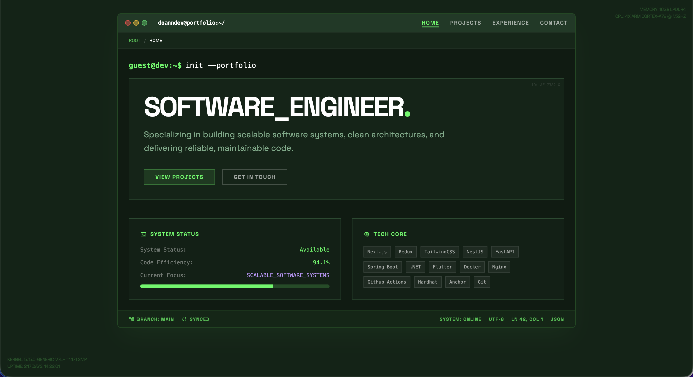

<div align="center">

</div>

# Terminal Dev Portfolio

A modern, terminal-inspired developer portfolio built with React, TypeScript, and Tailwind CSS. Features a unique boot sequence animation, responsive design, and a sleek cyberpunk aesthetic.

## ✨ Features

- **🚀 Boot Animation**: Terminal-style typing animation on page load
- **💻 Terminal UI**: Authentic terminal look with command prompts and system info
- **📱 Responsive Design**: Works seamlessly on desktop, tablet, and mobile
- **🎨 Cyberpunk Theme**: Dark mode with green accent colors and retro vibes
- **⚡ Fast Performance**: Built with Vite for lightning-fast development and builds
- **🎯 Modern Stack**: React 19, TypeScript, Tailwind CSS, React Router

## 🛠️ Tech Stack

- **Frontend**: React 19, TypeScript
- **Styling**: Tailwind CSS, Custom CSS animations
- **Routing**: React Router DOM
- **Build Tool**: Vite
- **UI Components**: Custom terminal components, shadcn/ui Progress
- **Icons**: Material Symbols
- **Fonts**: Space Grotesk

## 🚀 Getting Started

**Prerequisites:** Node.js 18+

1. **Clone the repository**
   ```bash
   git clone https://github.com/doanndev/terminal-dev-portfolio.git
   cd terminal-dev-portfolio
   ```

2. **Install dependencies**
   ```bash
   npm install
   ```

3. **Start the development server**
   ```bash
   npm run dev
   ```

4. **Build for production**
   ```bash
   npm run build
   ```

## 📁 Project Structure

```
├── components/           # Reusable UI components
│   ├── ui/              # shadcn/ui components
│   ├── TerminalLayout.tsx
│   ├── ProjectCard.tsx
│   └── ExperienceItem.tsx
├── pages/               # Route pages
│   ├── Home.tsx
│   ├── Projects.tsx
│   ├── Experience.tsx
│   └── Contact.tsx
├── hooks/               # Custom React hooks
├── services/            # API services (Gemini AI)
├── constants.tsx        # Data and configuration
├── types.ts            # TypeScript type definitions
└── public/             # Static assets
```

## 🎨 Customization

1. **Update Personal Info**: Edit `constants.tsx` to add your projects and experience
2. **Modify Colors**: Update the color scheme in `tailwind.config.cjs`
3. **Add Projects**: Add new entries to `PROJECTS_DATA` in `constants.tsx`
4. **Update Experience**: Modify `EXPERIENCE_DATA` with your work history

## 🌟 Key Features

- **Staged Reveal Animation**: Content appears sequentially like a system boot
- **Terminal Aesthetics**: Authentic terminal styling with blinking cursors
- **Project Showcase**: Interactive project cards with tech stacks
- **Experience Timeline**: Professional experience in JSON format
- **Contact Integration**: Gemini AI-powered contact form
- **SEO Optimized**: Meta tags, Open Graph, and favicon support

## 📱 Pages

- **Home**: Main landing with system status and tech stack
- **Projects**: Portfolio projects with detailed information
- **Experience**: Professional experience and skills
- **Contact**: Get in touch form with AI assistance

## 🤝 Contributing

Feel free to fork this project and customize it for your own portfolio! If you find bugs or have suggestions, please open an issue.

## 📄 License

This project is open source and available under the [MIT License](LICENSE).
